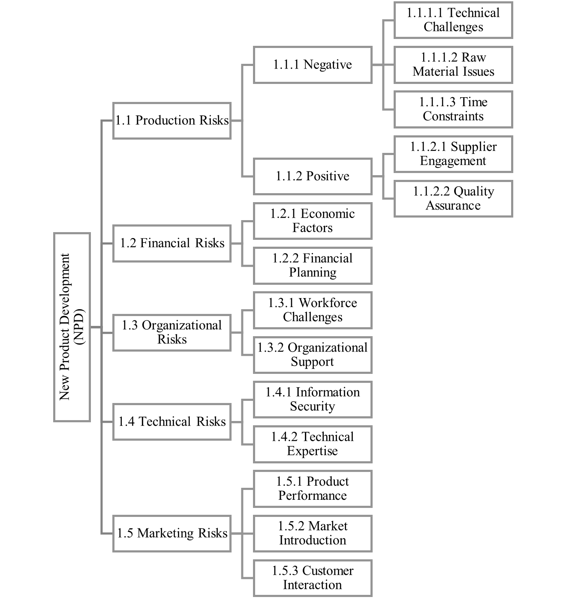

# Spectral Clustering for New Product Development Risk Analysis

**A data-driven case study for categorizing new product development risks using unsupervised learning and Spectral Clustering.**

## Overview

Risk management in New Product Development (NPD) involves multiple risks with different characteristics and potential impacts on project objectives.

This project applies an unsupervised machine learning approach to identify groups of similar risks and support data-driven risk categorization.

The analysis combines clustering tendency assessment, cluster-number selection, Spectral Clustering, and internal cluster validation to identify and interpret meaningful risk groups.

---

## Problem

A set of risks associated with New Product Development needs to be categorized into meaningful groups.

The risks are unlabeled observations, so the analysis investigates whether the underlying structure of the quantitative risk data can be used to identify groups of similar risks.

The main question is:

> Can unsupervised learning be used to identify meaningful risk categories from the available risk-related data?

---

## Case Study & Dataset

The case study focuses on risks associated with New Product Development in the agriculture industry.

The risks were identified through a combination of literature review and input from experts within the organization. Additional risks were identified through brainstorming sessions with seven organizational experts.

Due to confidentiality considerations, detailed descriptions of individual risks are not disclosed. Instead, the case study provides the overall risk breakdown structure and assigns numerical codes to the risks used in the analysis.

### NPD Risk Structure

The case study organizes NPD risks into five main categories:

* Production Risks
* Financial Risks
* Organizational Risks
* Technical Risks
* Marketing Risks



The dataset contains **39 coded risk observations**.

The quantitative data used in the clustering analysis contains the following main variables:

* `Code`
* `P`
* `R`
* `F`
* `C`

The complete dataset and additional case-study context are available in the [`data/`](data/) directory.

---

## Objective

The objectives of this project are to:

* Assess whether the dataset exhibits a meaningful clustering structure.
* Determine an appropriate number of clusters.
* Apply Spectral Clustering to categorize the risks.
* Validate the resulting clusters using internal evaluation measures.
* Interpret the resulting risk groups in the context of New Product Development.

---

## Methodology

The complete analytical workflow is:


The workflow consists of the following stages:

```text
Risk Data
    ↓
Data Gathering & Transformation
    ↓
Hopkins Test
    ↓
Determine Number of Clusters
    ↓
Elbow Method + Gap Statistic
    ↓
Spectral Clustering
    ↓
Model Validation
    ↓
Risk Categorization & Interpretation
```

### 1. Data Preparation

The coded risk observations are transformed into the quantitative feature representation used for clustering.

The main dimensions used in the analysis are:

* `P`
* `R`
* `F`
* `C`

### 2. Hopkins Test

The Hopkins statistic is used to assess whether the observations exhibit a tendency toward clustering.

The dataset initially passed the Hopkins test with a value of approximately **0.747**.

### 3. Determining the Number of Clusters

Two complementary methods are used:

* Elbow Method
* Gap Statistic

Both methods support using **four clusters** for the subsequent clustering analysis.

### 4. Spectral Clustering

Spectral Clustering is applied to the unlabeled risk data.

The study selects Spectral Clustering because the problem involves unlabeled observations and multiple risk-related features, with the objective of categorizing risks according to their impact characteristics.

### 5. Cluster Validation

The resulting clusters are evaluated using internal validation measures because the risk observations do not have predefined reference labels.

The analysis uses:

* Davies-Bouldin Index
* Silhouette Coefficient

---

## Results

The final analysis identifies **four risk clusters**.

The resulting groups are interpreted in relation to:

* Processes and new product development
* Incremental growth
* Product value-chain management
* Market and environment

### Elbow Method


The Elbow Method examines the change in within-cluster distortion as the number of clusters increases.

### Gap Statistic


The Gap Statistic provides an additional criterion for determining the appropriate number of clusters.

The maximum Gap Statistic occurs at **four clusters**.

### Cluster Characteristics


This visualization compares the mean values of the main risk dimensions across the four identified clusters.

### Cluster Distribution


The pairplot visualizes relationships among the risk dimensions while distinguishing observations assigned to the four clusters.

---

## Key Findings

The clustering analysis produces four groups of risks with different characteristics.

The resulting categories provide a data-driven view of the risk structure and demonstrate how unsupervised learning can support risk categorization in a practical New Product Development setting.

The approach combines:

**case-study context → quantitative risk data → clustering assessment → model selection → unsupervised learning → validation → interpretation**

---

## Project Structure

```text
spectral-clustering-risk-analysis/
│
├── README.md
├── requirements.txt
├── .gitignore
│
├── src/
│   ├── 01_hopkins_test.py
│   ├── 02_elbow_method.py
│   ├── 03_gap_statistic.py
│   └── 04_spectral_clustering.py
│
├── data/
│   ├── README.md
│   ├── Data.xlsx
│   └── figures/
│       └── npd-risk-structure.png
│
├── results/
│   ├── README.md
│   └── figures/
│       ├── methodology-flowchart.png
│       ├── elbow-method.png
│       ├── gap-statistic.png
│       ├── cluster-scores.png
│       └── cluster-distribution-pairplot.png
│
└── paper/
    └── README.md
```

---

## How to Run

Clone the repository and install the required dependencies:

```bash
pip install -r requirements.txt
```

Run the analysis scripts in the following order:

```bash
python src/01_hopkins_test.py
python src/02_elbow_method.py
python src/03_gap_statistic.py
python src/04_spectral_clustering.py
```

The dataset used by the analysis is located at:

```text
data/Data.xlsx
```

---

## Reference

Haghshenas, M., & Ashrafi, M. (2023).

**Spectral Clustering for Effective Risk Categorization in New Product Development: A Case Study.**

The 19th Iranian International Industrial Engineering Conference (IIIEC 2023), Amirkabir University of Technology, Tehran, Iran.

---

## Key Takeaway

This project demonstrates an end-to-end unsupervised learning workflow for a real-world risk categorization problem:

**Data → Clustering Assessment → Model Selection → Spectral Clustering → Validation → Risk Interpretation**

The project combines machine learning methodology with a practical decision-support problem in New Product Development.
