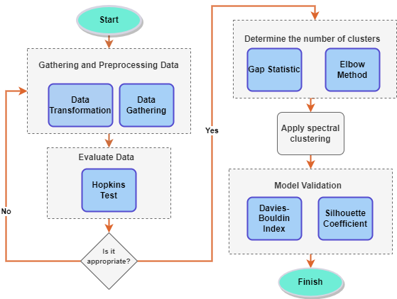
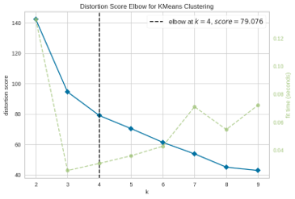
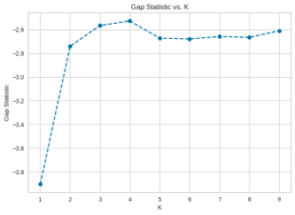
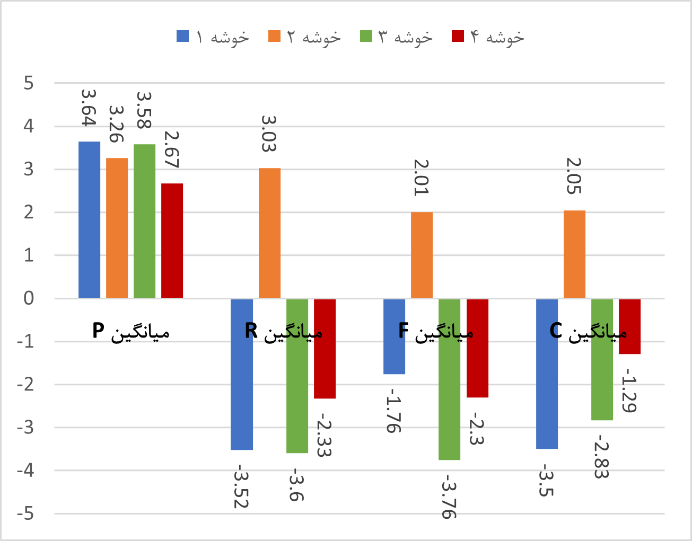
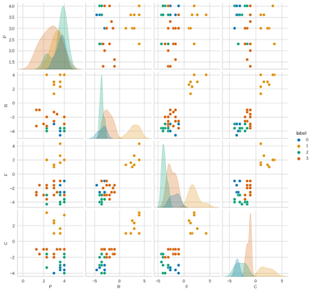

# Results

This folder contains the main visual outputs of the clustering analysis.

The results document the analytical stages used to determine the number of clusters, apply Spectral Clustering, and examine the characteristics of the resulting risk groups.

## Analytical Workflow

The overall methodology consists of:

1. Data preparation
2. Clustering tendency assessment using the Hopkins Test
3. Determining the number of clusters using the Elbow Method and Gap Statistic
4. Spectral Clustering
5. Cluster validation
6. Risk-group interpretation

The complete workflow is illustrated below.

## Cluster Number Selection

Two complementary approaches were used to determine the appropriate number of clusters.

### Elbow Method

The Elbow Method examines the change in within-cluster distortion as the number of clusters increases.

The analysis supports selecting four clusters.

### Gap Statistic

The Gap Statistic provides an additional criterion for determining the appropriate number of clusters.

The maximum Gap Statistic occurs at four clusters.

## Cluster Analysis

### Cluster Characteristics

This visualization compares the mean values of the main risk dimensions across the four identified clusters.

### Cluster Distribution

The pairplot visualizes relationships among the risk dimensions while distinguishing observations assigned to the four clusters.

## Final Clustering Result

The Spectral Clustering analysis produces four groups of risks.

The resulting groups are interpreted in the context of:

* Processes and new product development
* Incremental growth
* Product value-chain management
* Market and environment

The visual results provide a data-driven view of the structure identified by the clustering analysis.
